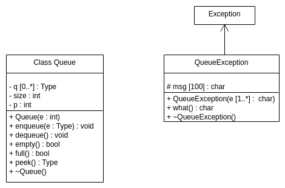

# Documentação da classe
class template

---

### que::Queue
```c++
template <class T> class Queue; // modelo genérico
```

_class_ __Queue__

Classe da estrutura de dados (Fila)

__Versão:__
  - 0.0.1

__Autor:__ Lucas Fontes buzuti

---

## Construtor
`que::Queue<Type>(int e)`

Cria uma fila a partir de um tamanho determinado pelo usuário.

## Métodos

|      |                                Descrição                                  |
|------|---------------------------------------------------------------------------|
| void | [`enqueue(Type e)`](#enqueue) - Anexa o próximo elemento para a próxima posição vazia. |
| Type | [`dequeue()`](#dequeue) - Remove o primeiro elemento da fila.                                      |
| bool | [`empty()`](#empty) - Verifica se a fila está vazia.                               |
| bool | [`full()`](#full) - Verifica se a fila está cheia.                                |
| Type | [`peek()`](#peek) - Informa o elemento do início da fila.                            |

---

## Detalhe do Construtor

### `Queue<Type>`

`que::Queue<Type>::Queue(int size)`

- Cria uma fila a partir de um tamanho determinado pelo usuário.
- __Parâmetros:__
  - int size - Tamanho da fila.

```c++
#include <iostream>
#include "queue.h" // classe Queue

using namespace std;

#define SIZE 6

int main(int argc, char *argv[])
{
  que::Queue<int> queue(SIZE); // inicialização da classe Queue

  return 0;
}
```

## Detalhe do Destrutor

### `~Queue<Type>`
`que::Queue<Type>::~Queue()`

- Destrói a fila criada.

## Detalhe dos Métodos

#### __enqueue__
`que::Queue<Type>::enqueue(Type e)`
- Anexa o próximo elemento para a próxima posição vazia.
- __Parâmetros:__
  - Type e - Elemento a ser enfileirado.

#### __dequeue__
`que::Queue<Type>::dequeue()`
- Remove o primeiro elemento da fila.
- __Retorno:__
  - O elemento que foi removido.

#### __empty__
`que::Queue<Type>::empty()`
- Verifica se a fila está vazia.
- __Retorno:__
  - Retorna `true` no caso em que a fila está vazia, ou `false` para a condição oposta.

#### __full__
`que::Queue<Type>::full()`
- Verifica se a fila está cheia.
- __Retorno:__
  - Retorna `true` no caso em que a fila está cheia, ou `false` para a condição oposta.

#### __peek__
`que::Queue<Type>::peek()`
- Informa o elemento do início da fila.
- __Retorno:__
  - O elemento que se encontra no início da fila.

---

## Tratamento de Erro

### que::QueueException

Os métodos `enqueue`, `dequeue` e `peek` necessitam de tratamento de erros. Para fazer esses tratamentos pode-se utilizar a classe `que::QueueException`.

```c++
#include <iostream>
#include "queue.h" // classe Queue

using namespace std;

#define SIZE 6

int main(int argc, char *argv[])
{
  que::Queue<int> queue(SIZE); // inicialização da classe Queue

  try{
    queue.dequeue();
  }catch(que::QueueException e){
    cerr << "Error: " << e.what() << endl;
  }

  return 0;
}
```

---

## UML


