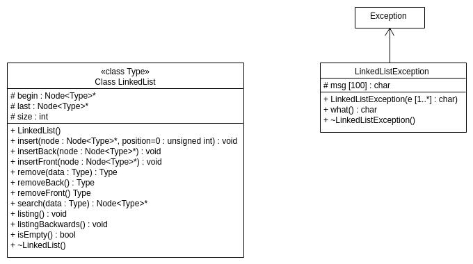

# Documentação da classe
class template

---

### dll::LinkedList
```c++
template <class T> class LinkedList; // modelo genérico
```

_class_ __LinkedList__

Classe da estrutura de dados (Lista Duplamente Encadeada)

__Versão:__
  - 0.0.1

__Autor:__ Lucas Fontes buzuti

---

## Construtor
`dll::LinkedList<Type>()`

Cria uma objeto lista.

## Métodos

|       |                                Descrição                                          |
|-------|-----------------------------------------------------------------------------------|
| int   | [`getSize()`](#getSize) - Obtem o tamanho da lista.                               |
| void  | [`insert(Node<Type>* node, unsigned int position=0)`](#insert) - Inclui um nó em qualquer posição da lista. |
| void  | [`insertBack(Node<Type>* node)`](#insertBack) - Inclui um nó no final na lista. |
| void  | [`insertFront(Node<Type>* node)`](#insertFront) - Inclui um nó no início na lista.|
| Type  | [`remove(Type data)`](#remove) - Remove qualquer e elemento da lista. |
| Type  | [`removeBack()`](#removeBack) - Remove um elemento do final da lista. |
| Type  | [`removeFront()`](#removeFront) - Remove um elemento do início da lista. |
| Node* | [`search(Type data)`](#search) - Pesquisa se um elemento pertence a lista. |
| void  | [`listing()`](#listing) - Imprime a lista. |
| void  | [`listingBackwards()`](#listingBackwards) - Imprime de trás para frente a lista. |
| bool | [`isEmpty()`](#isEmpty) - Verifica se a lista está vazia.

---

## Detalhe do Construtor

### `LinkedList<Type>`

`dll::LinkedList<Type>::LinkedList()`

- Cria uma objeto lista.

```c++
#include <iostream>
#include "dlist.h" //classe LinkedList

using namespace std;

int main(int argc, char *argv[])
{
  dll::LinkedList<int> list; //inicialização da classe LinkedList

  return 0;
}
```

## Detalhe do Destrutor

### `~LinkedList<Type>`
`dll::LinkedList<Type>::~LinkedList()`

- Destrói a lista criada.

## Detalhe dos Métodos

#### __getSize__
`dll::LinkedList<Type>::getSize()`
- Obter o tamanho na lista.
- __Retorno:__
  - O tamanho na lista.

#### __insert__
`dll::LinkedList<Type>::insert(Node<Type>* node, unsigned int position)`
- Insere um elemento em qualquer posição. Verifica se a lista está vazia e inicia a lista adicionando o primeiro nó a ela. Se a posição não for encontrada, uma exceção será lançada.
- __Parâmetros:__
  - Node<Type>* node - ponteiro para o objeto do nó.
  - int position - Posição para inserir um elemento (padrão: segunda posição [1]).

#### __insertBack__
`dll::LinkedList<Type>::insertBack(Node<Type>* node)`
- Insere um elemento na última posição da lista. Verifique se a lista está vazia e inicie a lista adicionando o primeiro nó a ela.
- __Parâmetros:__
  - Node<Type>* node - ponteiro para o objeto do nó.

#### __insertFront__
`dll::LinkedList<Type>::insertFront(Node<Type>* node)`
- Insere um elemento na primeira posição da lista. Verifique se a lista está vazia e inicie a lista adicionando o primeiro nó a ela.
- __Parâmetros:__
  - Node<Type>* node - ponteiro para o objeto do nó.

#### __remove__
`dll::LinkedList<Type>::remove(Type data)`
- Remove um elemento em qualquer posição da lista. Verifique o status da lista e se ela está vazia ou o elemento não foi encontrado, portanto, uma exceção é lançada.
- __Retorno:__
  - Retorna o dado removido.

#### __removeBack__
`dll::LinkedList<Type>::removeBack()`
- Remove um elemento na última posição da lista. Verifique o status da lista e, se estiver vazio, uma exceção será lançada.
- __Retorno:__
  - Retorna o dado removido.

#### __removeFront__
`dll::LinkedList<Type>::removeFront()`
- Remove um elemento na primeira posição da lista. Verifique o status da lista e, se estiver vazio, uma exceção será lançada.
- __Retorno:__
  - Retorna o dado removido.

#### __search__
`dll::LinkedList<Type>::search(Type data)`
- Procura por um elemento na lista.
- __Parâmetros:__
  - Type2 data - dado a ser pesquisado.
- __Retorno:__
    - Procura por um elemento na lista e retorna um objeto nó ou NULL se o elemento não for encontrado.

#### __listing__
`dll::LinkedList<Type>::listing()`
- Imprime todos os elementos na lista.

#### __listingBackwards__
`dll::LinkedList<Type>::listingBackwards()`
- Imprime de trás para frente todos os elementos da lista.

#### __isEmpty__
`dll::LinkedList<Type>::isEmpty()`
- Informa o elemento do topo da pilha.
- __Retorno:__
  - Se a lista estiver vazia TRUE é retornado, senão FALSE é retornado.

---
---

### dll::Node
```c++
template <class T> class Node; // modelo genérico
```

_class_ __Node__

Classe Nó (Lista Duplamente Encadeada)

---

## Construtor
`dll::Node<Type>(Type data)`

Cria uma objeto nó de um dado estabelecido pelo úsuario.

## Atributo público
`Node<Type>* next`   - ponteiro de objeto para o próximo nó.
`Node<Type>* before` - ponteiro de objeto para o nó anterior.

## Métodos

|      |                     Descrição                     |
|------|---------------------------------------------------|
| Type | [`getData()`](#getData) - Obtem o conteúdo do nó. |

---

## Detalhe do Construtor

### `Node<Type>`
`dll::Node<Type>::Node(Type data)`

- Cria uma objeto nó de um dado estabelecido pelo úsuario.

## Detalhe do Destrutor

### `~Node()<Type>`
`dll::Node<Type>::~Node()`

- Destrói o nó criada.

## Detalhe dos Métodos

#### __getData__
`dll::LinkedList<Type>::getData()`
- Obtem o conteúdo do nó.
- __Retorno:__
  - O conteúdo do nó.

---
---

## Tratamento de Erro

### dll::LinkedListException

Os métodos `insert`, `insertBack`, `insertFront`, `remove`, `removeBack` e `removeFront` necessitam de tratamento de erros. Para fazer esses tratamentos pode-se utilizar a classe `dll::LinkedListException`.

```c++
#include <iostream>
#include "dlist.h" //classe LinkedList

using namespace std;

int main(int argc, char *argv[])
{
  dll::LinkedList<int> list; //inicialização da classe LinkedList

  try
  {
    list.insertBack(new dll::Node<int>(1)); //inclui um nó com conteúdo '1' na lista

  } catch(dll::LinkedListException &e) { //classe de exceção
    cerr << "Exception occurred: " << e.what() << endl;
  }

  return 0;
}
```

---

## UML


