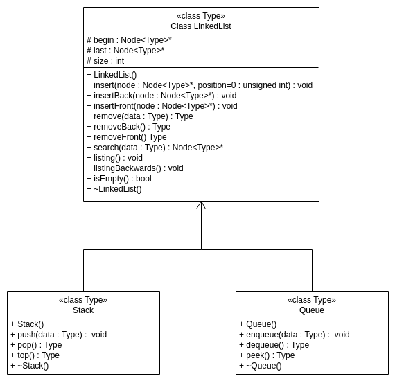

### Documentação da classe lista duplamente encadeada
Para acessar a documentação da classe [link aqui](https://github.com/buzutilucas/scientific-programming/tree/master/Ex02/Lista/Doc)

### Como Compilar
__Linux e MacOS__

> :warning:  Utilizou-se o compilador _GCC_ e _C++11_.

Para compilar e executar o programa teste abra o terminal e execute os comandos abaixo.
```
make -f Makefile
./mainList
./mainStack
./mainQueue
```
ou simplesmente executa o programa teste já compilado com o comando `./mainList` (teste da classe lista), `./mainStack` (teste da classe pilha) e `./mainQueue` (teste da classe fila).

__Windows:__ Executar o programa teste já compilado: `mainList` (teste da classe lista), `mainStack` (teste da classe pilha) e `mainQueue` (teste da classe fila).

---

### UML
A figura abaixo representa a _UML_ das classes `LinkedList`, `Stack` e `Queue`.


