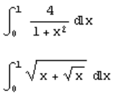
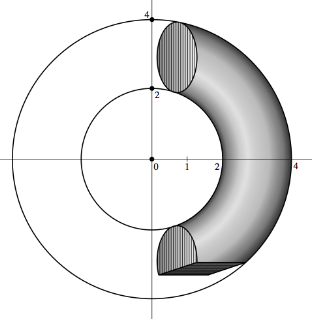
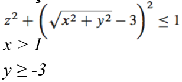

### Documentação da classe
Para acessar a documentação da classe ~~[link aqui](https://github.com/buzutilucas/scientific-programming/tree/master/Ex07/Monte_Carlo_MPI/Doc)~~

### Como Compilar
__Linux e ~~MacOS~~__

> :warning:  Utilizou-se MPI Versão 2 (mpicxx para C++).

Para compilar e executar o programa teste abra o terminal e execute os comandos abaixo.

```
chmod +x script.sh
./script.sh
```
ou simplesmente executa o programa teste já compilado com o comando `mpiexec -n 4 ./main`.

### Exercício 01

O arquivo `script.sh` é referente ao exercício 01, no qual pede para calcular a solução das seguintes integrais:



### Exercício 02

O arquivo `script_EX02.sh` é referente ao exercício 02, no qual pede para calcular a integral de volume do seguinte objeto:



O objeto é a interseção de um toroide com um cubo, dado pelas seguintes condições:


